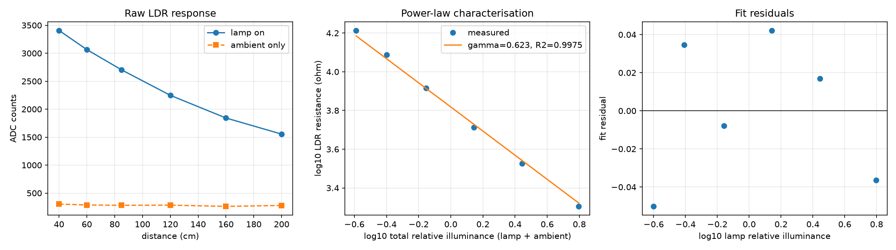

# Sensor calibration

Closes the open issue raised in CW1: *"the analog LDR is uncalibrated - raw readings need a conversion curve"*.

## Method

No reference light meter was used, and none is needed. Classification is relative to a saved reference setup, so absolute lux is not required - what is required is the LDR's *response curve*. Holding lamp output fixed and varying distance makes illuminance a known quantity up to a scale factor via the inverse-square law, so a tape measure serves as the reference instrument.

Two controls make this a measurement rather than a convenience:

1. **Ambient subtraction** - a lamp-off reading at every distance, subtracted in the resistance domain (counts are non-linear in illuminance, so subtracting counts would subtract the wrong quantity).
2. **An independent channel** - the on-board APDS9960 records the same changes, so the LDR is cross-checked rather than trusted.

## LDR characterisation

Fitted `log10(R_ldr) = a - gamma * log10(E_rel)` over 6 distances:

| parameter | value |
|---|---|
| gamma (response exponent) | **0.623** |
| intercept a | 3.818 |
| fitted ambient E_amb (relative units) | 0.0079 |
| R^2 | **0.9975** |
| fit method | `ratio` |
| fixed divider resistor | 10000 ohm |
| distances swept | 40, 60, 85, 120, 160, 200 cm |

The room's own contribution `E_amb` is a *fitted* parameter, not an assumption. The cell responds to lamp + room together, so fitting against the lamp term alone biases gamma low - the response flattens at distance where the room dominates. Working with the ratio of the lamp-off to lamp-on resistance cancels the unknown scale factor and recovers both gamma and the ambient level. Verified against a simulated cell with a known exponent before being used on real data.

gamma = 0.623 sits in the 0.5-0.9 band typical of CdS photoresistors, so the cell is behaving as a normal photoresistor and the divider is operating in a sensible part of its range.

R^2 = 0.9975: the power law describes the response well.



## Cross-check against the APDS9960

Correlation between log APDS ambient and log relative illuminance: **0.9913**.

Strong agreement means two physically independent sensors saw the same change, which is real evidence the sweep measured illuminance and not an artefact.

## Ultrasonic calibration

Reported distance vs tape measure, per point:

| tape (mm) | reported (mm) | reported - tape (mm) | beam width (mm) | |
|---|---|---|---|---|
| 400 | 395.4 | -4.6 | 105 |  |
| 600 | 587.4 | -12.6 | 158 |  |
| 850 | 827.9 | -22.1 | 224 |  |
| 1200 | 1185.7 | -14.3 | 316 |  |
| 1600 | 1598.9 | -1.1 | 421 |  |
| 2000 | 2133.9 | +133.9 | 527 | **excluded** |

| parameter | all points | excluding flagged | ideal |
|---|---|---|---|
| slope | 1.0710 | **1.0041** | 1.0 |
| offset | -65.5 mm | **-14.8 mm** | 0 |
| RMSE | 37.2 mm | **7.2 mm** | - |
| n | 6 | 5 | - |

One point was flagged by the median-absolute-deviation rule applied to every point (|residual - median| > 5 x MAD). It is the only reading longer than the tape; every other point reads slightly short. That asymmetry is the signature of the echo returning from the background rather than the target: the beam cone reaches 527 mm across at the far end against a lamp panel roughly 200 mm wide, and a flat panel reflects specularly, so the panel echo can drop below the detector threshold while a wall behind it does not.

Including it would report slope 1.071 and RMSE 37.2 mm - readable as a 7% speed-of-sound error that is not present. Excluding it, slope is 1.0041 against an ideal 1.0 and the channel is good to **7.2 mm RMSE out to 160 cm**, which covers the whole operating envelope (reference +-30 cm).

The excluded point is a real result about the sensor, not a measurement failure: with a target this size, readings beyond 160 cm cannot be trusted unless the target fills more of the beam.

## Applying the calibration

`tools/train_offline.py` consumes `models/ldr_calibration.json`. The mapping from counts to relative illuminance is:

```
R_ldr  = R_FIXED * (4095 / counts - 1)
E_rel  = 10 ** ((a - log10(R_ldr)) / gamma)     # a=3.818, gamma=0.623
```

Absolute lux needs one further scale factor, obtainable from a single reference reading at any point on the curve. Nothing would need recollecting.