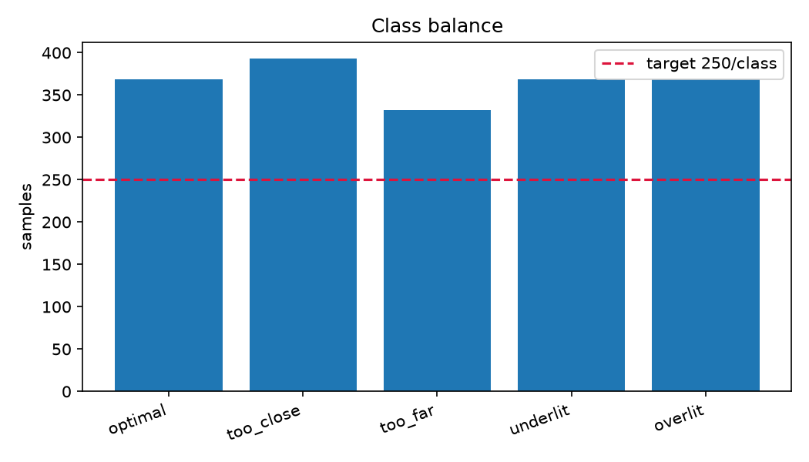

# Dataset report

- Capture files: **45**
- Total samples: **1832**

## Class balance

| label | class | samples | sessions | status |
|---|---|---|---|---|
| 0 | optimal | 369 | 3 | PASS |
| 1 | too_close | 393 | 3 | PASS |
| 2 | too_far | 332 | 3 | PASS |
| 3 | underlit | 369 | 3 | PASS |
| 4 | overlit | 369 | 3 | PASS |

Imbalance ratio (max/min): **1.18**

## Sessions

| session | samples | classes present |
|---|---|---|
| 1 | 576 | optimal, too_close, too_far, underlit, overlit |
| 2 | 627 | optimal, too_close, too_far, underlit, overlit |
| 3 | 629 | optimal, too_close, too_far, underlit, overlit |

## Data health

- NaN cells: **0**
- Ultrasonic dropouts: **0 (0.0%)**
- LDR pinned low: **0**, pinned high: **0**

## Per-class channel summary

Sanity-check these against the physical conditions you staged. `too_close` must show a lower mean distance than `too_far`; `underlit` must show a lower mean LDR than `overlit`. If not, runs were mislabelled.

|           |   dist_mm |    ldr |
|:----------|----------:|-------:|
| optimal   |    1021.3 | 2700.6 |
| too_close |     738.9 | 2753.6 |
| too_far   |    1582.1 | 2690.1 |
| underlit  |    1026.9 | 1878.5 |
| overlit   |    1026.9 | 3204.1 |

## Gate G2

**PASS** - dataset meets the collection protocol.