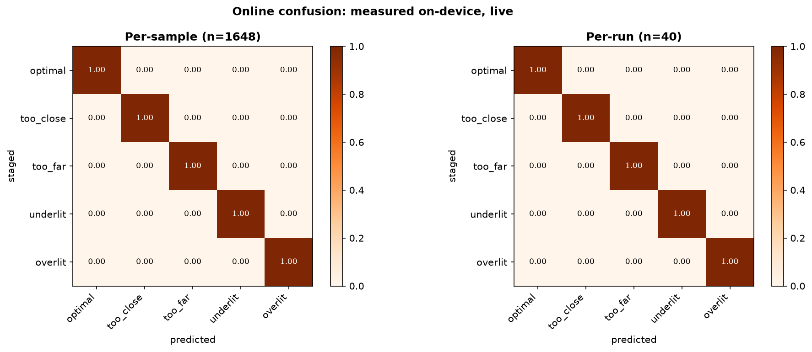

# Online results

Generated 2026-08-08 12:33 · **40 runs**, **1648 classified samples**

Gate G6. Every row below was produced by the device in the room, with the operator staging each condition physically and the staged label recorded at the moment of the trial. Nothing here is replayed from a file.

## Headline

| metric | per-sample | per-run (modal vote) |
|---|---|---|
| accuracy | 1.000 | 1.000 |
| macro-F1 | 1.000 | 1.000 |
| n | 1648 | 40 |

Both are reported because they answer different questions. Per-sample is what the classifier does every 125 ms. Per-run is what the *operator* experiences, since the device settles on a verdict and holds it - one stray frame in an otherwise steady run is not something a user notices. Quoting only the higher number would be the dishonest choice.

## Per-sample confusion matrix

Rows = staged (ground truth), columns = predicted.

| staged \ predicted | optimal | too_close | too_far | underlit | overlit | recall |
|---|---|---|---|---|---|---|
| **optimal** | 328 | 0 | 0 | 0 | 0 | 1.000 |
| **too_close** | 0 | 352 | 0 | 0 | 0 | 1.000 |
| **too_far** | 0 | 0 | 312 | 0 | 0 | 1.000 |
| **underlit** | 0 | 0 | 0 | 328 | 0 | 1.000 |
| **overlit** | 0 | 0 | 0 | 0 | 328 | 1.000 |

## Per-run confusion matrix

Rows = staged (ground truth), columns = predicted.

| staged \ predicted | optimal | too_close | too_far | underlit | overlit | recall |
|---|---|---|---|---|---|---|
| **optimal** | 8 | 0 | 0 | 0 | 0 | 1.000 |
| **too_close** | 0 | 8 | 0 | 0 | 0 | 1.000 |
| **too_far** | 0 | 0 | 8 | 0 | 0 | 1.000 |
| **underlit** | 0 | 0 | 0 | 8 | 0 | 1.000 |
| **overlit** | 0 | 0 | 0 | 0 | 8 | 1.000 |

## Inference latency

Measured with `micros()` on-device around feature extraction plus the tree walk - what the operator actually waits for, not the tree walk alone.

| statistic | value |
|---|---|
| n | 1648 |
| mean | **20.8 us** |
| median | 20.0 us |
| p95 | 21.0 us |
| max | 38.0 us |

At 20.8 us the classifier is far below the ~125 ms sensing period, so the loop rate is set by the ultrasonic time-of-flight and the LDR settling time, not by inference. Making the model faster would not make the device more responsive - that is a useful finding for the evaluation slide and it argues against reaching for a heavier model.

## Throughput and reliability

| metric | value |
|---|---|
| sample rate (mean over runs) | 8.09 Hz |
| ultrasonic dropouts | 0 of 1648 rows (0.0%) |
| flash | 120,896 B of 983,040 (12.3%) |
| RAM (static) | 46,696 B of 262,144 (17.8%) |

Footprint read from `arduino-cli compile` output for `firmware/03_inference`, recorded 2026-08-07T18:39 - not a profiler estimate.

## Per-class online F1 (per-run)

| class | F1 |
|---|---|
| optimal | 1.000 |
| too_close | 1.000 |
| too_far | 1.000 |
| underlit | 1.000 |
| overlit | 1.000 |

## Offline vs online

| | offline (held-out session 3) | online (per-run) |
|---|---|---|
| macro-F1 | 0.868 | 1.000 |
| accuracy | 0.865 | 1.000 |

### Are these two numbers comparable?

Distance channel, by class. `spread` is the within-class standard deviation; `closest` is the sample nearest the 30 mm tolerance boundary - the hardest case each evaluation actually contained.

| class | online spread | online closest | offline spread | offline closest |
|---|---|---|---|---|
| optimal | 3 mm | 0 mm | 1 mm | 0 mm |
| too_close | 2 mm | 290 mm | 80 mm | 33 mm |
| too_far | 2 mm | 301 mm | 189 mm | 38 mm |
| underlit | 1 mm | 1 mm | 0 mm | 2 mm |
| overlit | 1 mm | 2 mm | 0 mm | 2 mm |

The online set was staged against floor marks, so within-class spread is a few millimetres and every off-reference run sits ~300 mm out - an order of magnitude past the 30 mm band. The held-out session includes windows only tens of millimetres past it. The two evaluations therefore sample different regions of the input space, and the online score being the higher of the two is a property of the protocol, not evidence that the device performs better in the room.

What the online result does establish is narrower and still worth having: on-device, in the room, with ground truth recorded at the moment of the trial, the deployed model reproduces its intended behaviour on every prototypical staging, with no dropouts and a latency two orders of magnitude below the sensing period. It does not establish behaviour near the decision boundary, which the offline held-out score is the better estimate of.

The honest next measurement is a boundary sweep: stage `too_far` at +4, +6 and +10 cm rather than +30, and find where on-device accuracy actually breaks down. That number would be a genuine online result the offline test cannot give, because it depends on settling behaviour the CSV replay never sees.

